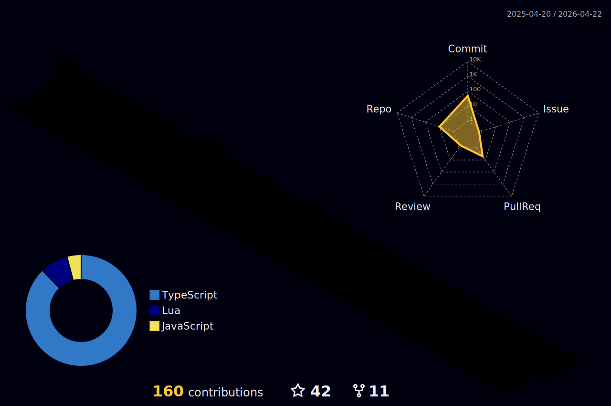

### Hi there 👋

- 📫 How to reach me: Discord : Hamid#7784

 <h2>🥇 My Github Status</h2>

  
  

  

<!-- 
   -->
  

<picture>
  <source media="(prefers-color-scheme: dark)" srcset="github-snake-dark.svg">
  <source media="(prefers-color-scheme: light)" srcset="github-snake.svg">
  
</picture>

